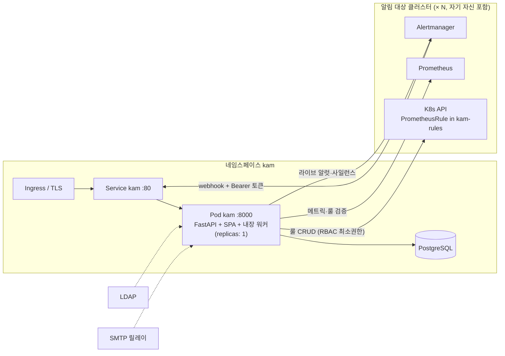

# 배포 가이드 (Docker / Kubernetes)

KAM을 컨테이너 이미지로 빌드해 쿠버네티스 클러스터에 배포하고, 알림을 받을 클러스터들을
연결하는 절차입니다. 로컬 개발 흐름(`make dev-up`, 호스트에서 `make backend`/`make frontend`)은
이 문서와 무관합니다 — [루트 README](../README.md)를 참고하세요.

1. [배포 구조](#1-배포-구조)
2. [사전 준비물](#2-사전-준비물)
3. [이미지 빌드](#3-이미지-빌드)
4. [설정 레퍼런스 (ConfigMap / Secret)](#4-설정-레퍼런스-configmap--secret)
5. [데이터베이스](#5-데이터베이스)
6. [배포 순서](#6-배포-순서)
7. [외부 노출 (Ingress / TLS)](#7-외부-노출-ingress--tls)
8. [클러스터 등록과 Alertmanager 연결](#8-클러스터-등록과-alertmanager-연결)
9. [LDAP / SMTP 요건](#9-ldap--smtp-요건)
10. [채널 플러그인 배포](#10-채널-플러그인-배포)
11. [운영: 헬스체크 · 업그레이드 · 시크릿 회전](#11-운영-헬스체크--업그레이드--시크릿-회전)
12. [확장과 HA 한계](#12-확장과-ha-한계)
13. [로컬 kind 검증](#13-로컬-kind-검증)
14. [트러블슈팅](#14-트러블슈팅)

## 1. 배포 구조



- 단일 이미지가 API + 빌드된 SPA + 백그라운드 워커(outbox 전송·스케줄러)를 한 프로세스로 실행합니다.
- Helm/kustomize 없이 **평범한 YAML**(`deploy/k8s/`)만 사용합니다. 레지스트리·호스트명은 직접 수정합니다.
- 알림 대상 클러스터는 KAM이 돌아가는 클러스터 자신을 포함해 **클러스터마다 등록**합니다(§8).

## 2. 사전 준비물

- Docker, 대상 클러스터의 `kubectl` 접근 권한, (로컬 검증용) `kind`
- **PostgreSQL** — 관리형 DB 권장(§5)
- **LDAP** 디렉터리와 **SMTP** 릴레이(§9)
- 알림 대상 클러스터마다: Prometheus Operator(PrometheusRule CRD) + Alertmanager, 그리고 그 Alertmanager에서 KAM에 도달 가능한 네트워크 경로

## 3. 이미지 빌드

```bash
make image                      # = docker build -f deploy/Dockerfile -t kam:local .
docker tag kam:local registry.example.org/kam:1.0.0
docker push registry.example.org/kam:1.0.0
```

`deploy/Dockerfile`은 3단계 멀티스테이지입니다: ① `frontend/` 빌드 → ② `backend/` 의존성을 uv로
venv에 해석(잠금 파일만 복사하므로 의존성이 바뀔 때만 레이어 재생성) → ③ `python:3.12-slim`
런타임에 venv + 앱 + SPA(`app/static/`) 복사. 컨테이너는 **비루트(uid/gid 1000 `kam`)** 로 실행되고,
엔트리포인트(`deploy/docker-entrypoint.sh`)가 매 기동 시 `alembic upgrade head`를 실행한 뒤
uvicorn(:8000)을 띄웁니다.

푸시한 이미지 참조로 `deploy/k8s/deployment.yaml`의 `image:`를 바꾸거나 배포 후
`kubectl -n kam set image deployment/kam kam=registry.example.org/kam:1.0.0`으로 갱신합니다.

## 4. 설정 레퍼런스 (ConfigMap / Secret)

모든 설정은 `KAM_*` 환경변수이며(`backend/app/config.py`) Deployment가 `envFrom`으로 두 오브젝트를
읽습니다. **자격증명 성격은 Secret, 나머지는 ConfigMap**에 둡니다.

`deploy/k8s/configmap.yaml` (비밀 아님):

| 변수 | 의미 | 배포 시 확인 |
|---|---|---|
| `KAM_COOKIE_SECURE` | 세션 쿠키 `Secure` 플래그 | HTTPS면 `"true"`(기본). **HTTP로만 접근하면 로그인이 안 되므로** 그 경우에만 `"false"` |
| `KAM_JWT_TTL_HOURS` | 세션 수명 | 기본 12 |
| `KAM_LDAP_URL`, `KAM_LDAP_USER_BASE`, `KAM_LDAP_USER_FILTER`, `KAM_LDAP_GROUP_BASE` | 디렉터리 구조 | 실제 디렉터리 값으로 교체 |
| `KAM_LDAP_ADMIN_GROUPS` | 전역 admin 그룹 DN 목록 | **`;` 구분**(DN 안에 `,`가 있으므로) |
| `KAM_DEFAULT_CLUSTER_NAME`, `KAM_PROMETHEUS_URL`, `KAM_ALERTMANAGER_URL` | 첫 기동 시 자동 시드되는 기본 클러스터 | §8의 "기본 시드 클러스터" 참고 |
| `KAM_WEBHOOK_BASE_URL` | Alertmanager 리시버 스니펫에 들어갈 KAM 주소 | **각 클러스터의 Alertmanager에서 도달 가능한 주소**여야 함(같은 클러스터면 `http://kam.kam.svc.cluster.local`, 외부 클러스터면 Ingress URL) |
| `KAM_APP_BASE_URL` | 알림 메일/메시지 속 딥링크의 기준 URL | **사용자가 브라우저로 여는 공개 URL**(예: `https://kam.example.org`)로 교체 — 기본값(svc DNS)은 클러스터 밖에서 열리지 않음 |
| `KAM_SMTP_HOST`, `KAM_SMTP_PORT`, `KAM_SMTP_STARTTLS` | 발신 릴레이 연결 | 인증 정보는 Secret |
| `KAM_PLUGINS_DIR` | 채널 플러그인 디렉터리 | 기본 빈 값(비활성), §10 |
| `KAM_WORKER_MODE` | `embedded`(기본) / `off` | §12 |

`deploy/k8s/secret.example.yaml` → 복사해 `secret.yaml`로(gitignore 등록됨, 커밋 금지):

| 변수 | 의미 | 주의 |
|---|---|---|
| `KAM_SECRET_KEY` | JWT 서명 **및** 저장 자격증명(kubeconfig·채널 설정)의 Fernet 암호화 키 | **반드시 생성값으로 교체**. 회전하면 모든 세션이 무효화되고 **기존 암호화 값이 복호화 불가**(§11) |
| `KAM_WEBHOOK_TOKEN` | 기본 시드 클러스터의 웹훅 토큰 | **반드시 교체**. 기본값은 코드에 공개된 문자열이라 그대로 두면 누구나 알럿을 위조 주입 가능(`/api/v1/webhook/alertmanager`에 다른 인증 없음) |
| `KAM_LDAP_BIND_DN`, `KAM_LDAP_BIND_PASSWORD` | 디렉터리 조회용 서비스 계정 | |
| `KAM_SMTP_USERNAME`, `KAM_SMTP_PASSWORD` | 릴레이 인증(없으면 빈 값) | |
| `KAM_DATABASE_URL` | `postgresql+asyncpg://user:pw@host:5432/kam` | §5 |

생성값 만들기:

```bash
python3 -c "import secrets; print(secrets.token_urlsafe(32))"
```

두 필수 시크릿을 기본값으로 두면 앱은 뜨되 **기동 로그에 경고**가 남습니다
(`KAM_SECRET_KEY is set to the insecure default ...`). 배포 후 로그에서 이 경고가 없는지 확인하세요.
sealed-secrets/external-secrets 파이프라인이 있다면 평문 `secret.yaml` 대신 그쪽으로 생성하는 것을 권장합니다.

## 5. 데이터베이스

- **운영: 관리형 PostgreSQL**(RDS/Cloud SQL/Azure Database …)을 권장합니다. `KAM_DATABASE_URL`만 가리키면 됩니다.
- **소규모/검증용**: `deploy/k8s/postgres.example.yaml`(단일 인스턴스 StatefulSet, 복제·백업 없음)을 적용하고
  `kam-postgres:5432`로 연결합니다. 파일 안의 비밀번호 placeholder를 바꾸세요.
- **SQLite는 컨테이너 배포에 부적합**합니다(파일이 컨테이너 안에 생겨 재시작 시 유실). `KAM_DATABASE_URL`이 비어 있으면
  SQLite로 폴백하므로 Secret에 반드시 설정하세요.
- 마이그레이션은 별도 Job 없이 **매 기동 시 엔트리포인트가 자동 적용**합니다(이미 최신이면 no-op).
  이 방식이 안전한 전제가 "레플리카 1"입니다(§12).

## 6. 배포 순서

순서가 중요합니다 — Deployment는 ConfigMap/Secret/ServiceAccount가 먼저 있어야 하고,
RBAC Role은 `kam-rules` 네임스페이스가 있어야 생성됩니다.

```bash
# 0) KAM이 PrometheusRule을 쓸 네임스페이스 (rbac.yaml의 Role이 이 이름을 전제)
kubectl create namespace kam-rules

# 1) 시크릿 준비 (§4)
cp deploy/k8s/secret.example.yaml deploy/k8s/secret.yaml && $EDITOR deploy/k8s/secret.yaml

# 2) (선택) 인클러스터 Postgres — 관리형 DB를 쓰면 생략
kubectl apply -f deploy/k8s/namespace.yaml
kubectl apply -f deploy/k8s/postgres.example.yaml

# 3) 앱
kubectl apply -f deploy/k8s/namespace.yaml
kubectl apply -f deploy/k8s/secret.yaml
kubectl apply -f deploy/k8s/configmap.yaml
kubectl apply -f deploy/k8s/serviceaccount.yaml
kubectl apply -f deploy/k8s/rbac.yaml
kubectl apply -f deploy/k8s/deployment.yaml
kubectl apply -f deploy/k8s/service.yaml
kubectl -n kam rollout status deployment/kam --timeout=180s
```

배포 확인:

```bash
kubectl -n kam logs deployment/kam | head -30      # "running database migrations" → "starting uvicorn", 경고 없음
kubectl -n kam port-forward svc/kam 8080:80 &
curl -s localhost:8080/healthz && curl -s localhost:8080/readyz   # {"status":"ok"} / {"status":"ready"}
```

클러스터마다 `rules_namespace`를 다르게 쓰려면 `rbac.yaml`의 Role/RoleBinding `namespace:`를 그에 맞춰
복제하세요 — Role은 네임스페이스 스코프라 지정한 곳 밖의 PrometheusRule은 절대 건드릴 수 없습니다.

## 7. 외부 노출 (Ingress / TLS)

`deploy/k8s/ingress.example.yaml`은 ingress-nginx + cert-manager 형태의 예시입니다. IngressClass·호스트·TLS
시크릿을 환경에 맞게 바꿔 적용하세요.

```bash
kubectl apply -f deploy/k8s/ingress.example.yaml   # 수정 후
```

HTTPS로 서비스할 때 `KAM_COOKIE_SECURE="true"`(기본)를 유지하고, `KAM_APP_BASE_URL`을 그 공개 URL로
맞추세요. Ingress 없이 임시로 확인만 한다면 `kubectl port-forward`를 쓰되, 이때는 HTTP라서
`KAM_COOKIE_SECURE="false"`가 아니면 로그인 쿠키가 저장되지 않습니다.

## 8. 클러스터 등록과 Alertmanager 연결

KAM은 **알림을 받을 클러스터마다** `Cluster` 행 하나를 갖습니다. KAM이 배포된 클러스터 자신도 등록 대상입니다.

### 8.1 UI에서 등록 (관리자 → 클러스터 → 클러스터 생성)

| 필드 | 설명 |
|---|---|
| 이름(slug) | 생성 후 변경 불가. 알럿 이력·통계의 클러스터 식별자 |
| k8s 인증 방식 | `incluster` — KAM 자신이 실행 중인 클러스터. 자격증명 불필요, `rbac.yaml`의 ServiceAccount 권한 사용 / `kubeconfig` — 원격 클러스터의 kubeconfig YAML 전체를 붙여넣기 / `token` — API URL + 서비스어카운트 토큰(+ CA 인증서 선택) |
| Prometheus URL / Alertmanager URL | **KAM Pod에서** 도달 가능한 주소(같은 클러스터면 서비스 DNS, 원격이면 Ingress 등) |
| Grafana URL (선택) | 알럿의 Grafana 딥링크 생성용 |
| 룰 네임스페이스 | 기본 `kam-rules` — 그 클러스터에서 KAM SA(또는 kubeconfig 주체)가 PrometheusRule을 CRUD할 수 있어야 함 |
| 하트비트 | Watchdog 알럿 수신 감시(기본 켬, 타임아웃 600초). 끊기면 합성 critical 알럿 발생 |

저장하면 **웹훅 토큰과 Alertmanager 설정 스니펫이 딱 한 번 표시**됩니다. DB에는 해시만 저장되므로
지금 복사해 두세요. 잃어버리면 목록의 **토큰 회전**으로 새로 발급합니다(기존 토큰은 즉시 무효).

원격 클러스터의 kubeconfig/토큰은 `KAM_SECRET_KEY`로 Fernet 암호화되어 저장되며 API 응답에 되돌려주지 않습니다.
원격 클러스터에는 `deploy/k8s/rbac.yaml`과 같은 최소 권한(그 클러스터의 `kam-rules`에 PrometheusRule CRUD +
namespaces get/list + `/version`)의 SA를 만들어 그 토큰을 쓰는 것을 권장합니다.

### 8.2 API로 등록

```bash
curl -s --cookie "$COOKIE" -H 'Content-Type: application/json' \
  -X POST https://kam.example.org/api/v1/clusters -d '{
    "name": "prod-a", "display_name": "Production A",
    "k8s_auth_kind": "incluster",
    "prometheus_url": "http://kps-kube-prometheus-stack-prometheus.monitoring.svc:9090",
    "alertmanager_url": "http://kps-kube-prometheus-stack-alertmanager.monitoring.svc:9093",
    "rules_namespace": "kam-rules"
  }'
# 응답의 webhook_token / am_config_snippet은 이 응답에서만 볼 수 있음
# 재발급: PATCH /api/v1/clusters/{id}  {"rotate_webhook_token": true}
```

### 8.3 Alertmanager 리시버 설정

응답/UI의 스니펫을 **해당 클러스터의** Alertmanager 설정에 붙입니다. 형태는 다음과 같습니다
(`KAM_WEBHOOK_BASE_URL` 기준으로 렌더링됨):

```yaml
receivers:
  - name: kam-webhook
    webhook_configs:
      - url: https://kam.example.org/api/v1/webhook/alertmanager
        send_resolved: true
        http_config:
          authorization:
            type: Bearer
            credentials: <발급된 토큰>
```

kube-prometheus-stack이라면 Helm values의 `alertmanager.config`에 넣고 라우트를 이 리시버로 향하게 합니다.
`dev/kube-prometheus-values.yaml`이 그 완성 예시입니다. 두 가지를 꼭 확인하세요:

- `send_resolved: true` — 해소 알림과 미해결 재알림 중단이 이 신호에 의존합니다.
- **Watchdog 알럿도 KAM으로 보내기** — 차트 기본값은 Watchdog을 `null` 리시버로 보냅니다. 하트비트 감시(deadman)는
  Watchdog 수신을 전제하므로, dev values처럼 별도 `null` 서브라우트를 없애거나 Watchdog 라우트를 KAM 리시버로 바꿔야 합니다.

`group_by`에 `kam_team`을 포함하면(예: `['alertname', 'kam_team']`) 팀별 그룹핑이 KAM의 팀 귀속과 맞물립니다.

### 8.4 기본 시드 클러스터

첫 기동 시 `KAM_DEFAULT_CLUSTER_NAME`(기본 `local`) 이름의 클러스터가 없으면 `KAM_PROMETHEUS_URL`/
`KAM_ALERTMANAGER_URL`/`KAM_WEBHOOK_TOKEN`으로 하나를 자동 생성합니다(`k8s_auth_kind=kubeconfig`).
운영에서는 둘 중 하나를 택하세요.

- ConfigMap의 URL을 실제 값으로 맞춰 이 행을 그대로 자기 클러스터로 쓰기 — 단 인증 방식이 `kubeconfig`라
  룰 CRUD를 쓰려면 UI에서 `incluster`로 수정
- 또는 §8.1로 명시 등록하고 시드 행은 UI에서 **비활성화**

어느 쪽이든 `KAM_WEBHOOK_TOKEN`은 반드시 교체돼 있어야 합니다(§4).

## 9. LDAP / SMTP 요건

- **LDAP** — 인증은 전부 LDAP 바인드입니다(자체 비밀번호 저장 없음). 흐름: 서비스 계정 바인드 → `KAM_LDAP_USER_BASE`에서
  `KAM_LDAP_USER_FILTER`로 사용자 검색 → 사용자 DN으로 재바인드(실제 인증) → 그룹 조회. `KAM_LDAP_ADMIN_GROUPS`의 그룹
  멤버는 전역 admin이 되고, 그 외 그룹은 관리자 화면에서 팀에 매핑합니다(로그인 시점에 동기화). 첫 로그인 후
  admin 계정으로 팀·매핑을 구성하세요.
- **SMTP** — 내장 이메일 채널의 발신 릴레이 하나(`KAM_SMTP_*`). 수신자·제목 접두사는 채널별 설정(UI)입니다.
  릴레이가 없어도 앱은 뜨지만 이메일 채널 전송은 재시도 끝에 `dead` 처리됩니다.

## 10. 채널 플러그인 배포

이메일 외 채널은 플러그인으로 추가합니다 — 개발 방법은 [`docs/channel-plugins.md`](../docs/channel-plugins.md).
컨테이너 배포에서는 두 방식 중 하나입니다.

- **파일 드롭인**: 플러그인 `.py`를 ConfigMap 등으로 Pod에 마운트하고 `KAM_PLUGINS_DIR`를 그 경로로 설정
  ```bash
  kubectl -n kam create configmap kam-plugins --from-file=slack_channel.py
  # deployment.yaml: volumes/volumeMounts로 /plugins에 마운트, configmap.yaml: KAM_PLUGINS_DIR="/plugins"
  ```
  플러그인이 앱 venv에 없는 패키지를 쓰면 로드 실패로 스킵됩니다(`httpx`, `pydantic`은 포함).
- **패키지 설치**: 플러그인을 `kam.channels` entry point가 있는 패키지로 만들고, Dockerfile 2단계(`uv sync` 뒤)에서
  venv에 설치한 이미지를 빌드합니다. 의존성을 함께 가져올 수 있어 배포 관리에 유리합니다.

등록 확인: `GET /api/v1/channel-types`에 타입이 보이거나, 기동 로그에 로드 실패 메시지가 없으면 됩니다.

## 11. 운영: 헬스체크 · 업그레이드 · 시크릿 회전

**프로브** — `livenessProbe`는 `/healthz`(프로세스 생존만), `readinessProbe`는 `/readyz`(DB `SELECT 1`, 실패 시 503).
DB가 끊기면 readiness만 떨어져 트래픽이 차단되고, 복구되면 재시작 없이 돌아옵니다.

**업그레이드** — 새 이미지를 푸시하고 `set image`(또는 `deployment.yaml` 수정 후 apply). 전략이 `Recreate`라
구 Pod 종료 → 신 Pod 기동 순서로 잠깐의 다운타임이 있고, 신 Pod 엔트리포인트가 마이그레이션을 적용합니다.
롤백은 이전 이미지로 `set image` — 단 스키마를 바꾼 릴리스는 이전 코드가 새 스키마와 호환되는지 먼저 확인하세요.

**`KAM_SECRET_KEY` 회전** — 이 키는 세션 서명뿐 아니라 저장된 kubeconfig·토큰·채널 설정의 암호화 키입니다.
바꾸면 모든 사용자가 로그아웃되고 **기존 암호화 값은 복호화되지 않아** 클러스터 자격증명과 채널 설정을
다시 입력해야 합니다. 정말 필요할 때만, 재입력 계획을 세운 뒤 회전하세요.

**웹훅 토큰 회전** — 클러스터별로 UI/`PATCH /clusters/{id}`에서 회전 → 새 스니펫으로 Alertmanager 갱신.
회전 즉시 기존 토큰은 거부되므로 Alertmanager 반영 전까지 그 클러스터 알럿이 401로 유실됩니다 — 짧게 진행하세요.

**리소스** — `deployment.yaml`의 requests/limits(100m/256Mi ~ 500m/512Mi)는 출발점입니다. 알럿 볼륨·클러스터 수에
따라 조정하세요. 보존 기간(retention)·하트비트 타임아웃 등 런타임 설정은 관리자 UI에서 바꿉니다.

**로그** — 표준 출력(uvicorn + 앱 로거). 전송 실패·재시도·플러그인 로드 실패·기본 시크릿 경고가 모두 여기 남습니다.

## 12. 확장과 HA 한계

`replicas: 1`은 의도된 값입니다. 두 가지 이유가 있습니다.

1. 내장 워커(`KAM_WORKER_MODE=embedded`)에 리더 선출이 없습니다. outbox 전송 자체는 PostgreSQL의
   `FOR UPDATE SKIP LOCKED`로 중복 전송이 막히지만, 같은 루프에 얹힌 하트비트·retention·리포트 스윕은
   레플리카마다 중복 실행됩니다.
2. 엔트리포인트의 `alembic upgrade head`에 락이 없어 동시에 뜨는 Pod들이 같은 마이그레이션을 경합할 수 있습니다.

API 처리량만 늘리고 싶다면 **워커를 분리**하는 구성이 가능합니다.

- API Deployment: `KAM_WORKER_MODE=off`로 N 레플리카 (마이그레이션 경합은 여전히 주의 — 순차 롤아웃 권장)
- 워커 Deployment: 같은 이미지, `replicas: 1`, command를 `python -m app.worker.runner`로(`app/worker/runner.py` —
  자체 엔진/레지스트리를 만들어 API 없이 독립 실행)

워커 자체의 다중화(리더 선출)는 이 프로젝트 범위 밖입니다.

## 13. 로컬 kind 검증

```bash
make image
make deploy-kind      # kind load docker-image + kam-rules ns(idempotent) + §6 전체 적용 + rollout 대기
kubectl -n kam port-forward svc/kam 8080:80
make undeploy-kind    # 정리
```

기본 대상은 `dev/setup.sh`가 만드는 kind 클러스터 `kam`입니다(`KIND_CLUSTER=<이름>`으로 변경).
`secret.yaml`이 없으면 경고 후 계속 진행하지만 Pod는 CrashLoopBackOff에 빠지니 §4를 먼저 하세요.
`ingress.example.yaml`/`postgres.example.yaml`은 이 타깃이 적용하지 않습니다(직접 apply).
kind에서 호스트의 LDAP/Mailpit(compose)에 붙이려면 ConfigMap의 호스트를 `host.docker.internal`로 두면 됩니다.

### `kubectl auth can-i` 최소권한 매트릭스

`rbac.yaml`이 의도대로 동작하는지 확인하는 명령입니다(실제 kind 배포에서 검증됨).

```bash
SA=system:serviceaccount:kam:kam

# 허용 (yes)
kubectl auth can-i create prometheusrules --as=$SA -n kam-rules
kubectl auth can-i get    prometheusrules --as=$SA -n kam-rules
kubectl auth can-i list   prometheusrules --as=$SA -n kam-rules
kubectl auth can-i update prometheusrules --as=$SA -n kam-rules
kubectl auth can-i delete prometheusrules --as=$SA -n kam-rules
kubectl auth can-i list   namespaces      --as=$SA
kubectl auth can-i get    namespaces      --as=$SA
kubectl auth can-i get    /version        --as=$SA

# 거부 (no)
kubectl auth can-i create prometheusrules   --as=$SA -n default
kubectl auth can-i create prometheusrules   --as=$SA -n monitoring
kubectl auth can-i list   pods             --as=$SA -A
kubectl auth can-i get    secrets          --as=$SA -n kam-rules
kubectl auth can-i get    secrets          --as=$SA -n kam
kubectl auth can-i delete deployments      --as=$SA -A
kubectl auth can-i create clusterroles     --as=$SA
kubectl auth can-i delete namespaces       --as=$SA
kubectl auth can-i create alertmanagerconfigs --as=$SA -n kam-rules
```

## 14. 트러블슈팅

| 증상 | 확인할 것 |
|---|---|
| Pod `CrashLoopBackOff`, 로그에 DB 연결 오류 | `secret.yaml` 미적용 또는 `KAM_DATABASE_URL` 오류. `kubectl -n kam logs deployment/kam --previous` |
| `/readyz` 503 | DB 연결 불가(자격증명·네트워크·DB 다운). `/healthz`는 200이면 프로세스는 정상 |
| 로그인 실패(아이디/비밀번호 오류가 아닌 "인증 서버 연결 불가") | `KAM_LDAP_URL` 도달성, 바인드 DN/비밀번호, `KAM_LDAP_USER_FILTER`의 `{username}` 자리표시 |
| 로그인은 되는데 새로고침하면 풀림 | HTTP 접속인데 `KAM_COOKIE_SECURE="true"` — TLS를 붙이거나 임시로 `"false"` |
| 알럿이 안 들어옴 | Alertmanager 로그의 webhook 응답 코드: 401이면 토큰 불일치(회전 후 미갱신), 연결 실패면 `KAM_WEBHOOK_BASE_URL`이 그 클러스터에서 도달 불가. 관리자 → 클러스터의 하트비트 열도 확인 |
| 하트비트 "수신 이력 없음"이 계속됨 | Watchdog이 `null` 리시버로 가고 있음(§8.3) |
| 룰 저장 시 403 | 그 클러스터의 `rules_namespace`에 PrometheusRule CRUD 권한 없음 — can-i 매트릭스로 SA 권한 확인, 원격이면 kubeconfig/토큰 주체 권한 |
| 룰은 저장됐는데 Prometheus에 안 잡힘 | Operator의 `ruleSelector`가 `kam-rules`의 룰을 선택하지 않음(kube-prometheus-stack은 `ruleSelectorNilUsesHelmValues: false` 필요) |
| 메일이 안 감 | 알럿 이력 상세의 "알림 전송 이력"에서 오류 확인 → `KAM_SMTP_*`·릴레이 인증. 채널 목록의 테스트 버튼으로 재현 |
| 기동 로그에 `insecure default` 경고 | `KAM_SECRET_KEY`/`KAM_WEBHOOK_TOKEN`이 기본값 — §4 |
| 알림 속 링크가 열리지 않음 | `KAM_APP_BASE_URL`이 svc DNS 등 내부 주소 — 공개 URL로 교체 |
