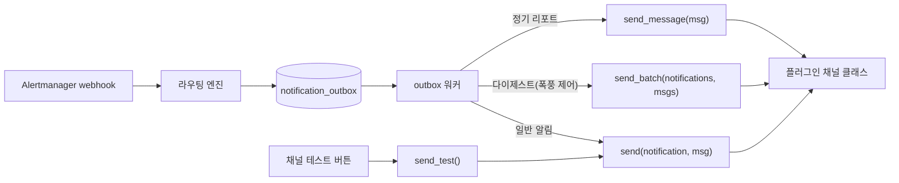

# 알림 채널 플러그인 — 개발 및 등록 가이드

KAM은 이메일(SMTP) 채널을 내장하고, 그 외 채널 타입(Slack, 웹훅, 사내 메신저 등)은
**파이썬 플러그인**으로 추가합니다. 플러그인은 클래스 하나를 구현하면 되고,
설정 폼·암호화 저장·재시도·폭풍 제어·템플릿 렌더링은 앱이 전부 처리합니다.
프론트엔드 코드는 손댈 필요가 없습니다.

이 문서는 세 단계로 구성됩니다.

1. [플러그인 개발](#1-플러그인-개발) — 인터페이스와 최소 구현
2. [앱에 등록(발견)](#2-앱에-등록발견) — 파일 드롭인 또는 패키지 entry point
3. [UI에서 채널 인스턴스 등록](#3-ui에서-채널-인스턴스-등록) — 팀별 채널 생성 → 테스트 → 라우팅 연결

참조 구현: [`plugins/example_webhook_channel/`](../plugins/example_webhook_channel/)
· 인터페이스 원본: [`backend/app/channels/base.py`](../backend/app/channels/base.py)
· 내장 이메일 구현: [`backend/app/channels/email.py`](../backend/app/channels/email.py)

## 동작 개요



- 워커가 outbox 행을 하나 꺼내 채널 클래스를 **행마다 새로 인스턴스화**하고(`cls(config)`),
  트리거 종류에 따라 `send` / `send_batch` / `send_message` 중 하나를 호출합니다.
- 메시지 본문은 호출 전에 이미 렌더링돼 `RenderedMessage`로 전달됩니다(라우팅 규칙 템플릿 →
  채널 템플릿 → 채널 타입 기본 템플릿 → 앱 기본 템플릿 순). 플러그인은 포맷팅을 다시 할 필요가 없습니다.
- `send()`가 `ChannelDeliveryError`를 raise하면 워커가 **재시도**합니다
  (지수 백오프 30초 × 2ⁿ, 최대 30분, 8회 실패 시 `dead`). 성공 시 아무것도 반환하지 않으면 됩니다.

## 1. 플러그인 개발

### 1.1 인터페이스 — `NotificationChannel`

`app.channels.base.NotificationChannel`을 상속하고 아래를 채웁니다.

**클래스 속성**

| 속성 | 필수 | 설명 |
|---|---|---|
| `type_name: str` | ✅ | 채널 타입의 고유 키. DB(`channels.type`)와 레지스트리 키로 쓰이므로 한 번 정하면 바꾸지 않습니다. 소문자 스네이크 권장(`slack`, `ms_teams`). |
| `display_name: str` | ✅ | UI 타입 선택기에 보이는 이름. |
| `config_schema: type[BaseModel]` | ✅ | 채널 **인스턴스별** 설정(웹훅 URL, 수신자 등)을 정의하는 pydantic 모델. JSON Schema로 노출되어 UI 폼이 자동 생성됩니다(§1.4). |
| `default_templates: dict[str, str]` | 선택 | 이 채널 타입의 기본 Jinja2 템플릿(`title`/`body`/`body_html` 슬롯). 비우면 앱 기본 템플릿 사용(§1.5). |

**메서드**

| 메서드 | 필수 | 언제 호출되나 |
|---|---|---|
| `async send(notification, msg)` | ✅ | 알럿 1건 전송(firing/resolved/escalation/renotify/test). |
| `async send_batch(notifications, msgs)` | 선택 | 폭풍 제어 다이제스트 — N건을 한 메시지로. 기본 구현은 `send()`를 N번 순서대로 호출. |
| `async send_message(msg)` | 선택 | 정기 리포트 등 알럿이 없는 콘텐츠. 기본 구현은 자리표시 알럿(`AlertNotification.example_info()`)을 만들어 `send()`로 위임. |
| `async send_test()` | 선택 | UI의 테스트 버튼. 기본 구현은 샘플 알럿을 기본 템플릿으로 렌더해 `send()` 호출 — 보통 오버라이드 불필요. |

> **시그니처 주의**: `send(notification, msg)` 두 인자입니다. 구버전 `send(notification)`
> 형태로 만들면 등록은 되지만 **전송 시점에 TypeError**로 실패합니다.

### 1.2 전달되는 데이터

`AlertNotification` (원본 알럿 데이터):

| 필드 | 타입 | 비고 |
|---|---|---|
| `trigger` | `"firing" \| "resolved" \| "test" \| "info"` | `test`=테스트 발송, `info`=`send_message` 기본 어댑터의 자리표시 |
| `alertname`, `cluster`, `team_slug` | `str` | |
| `severity`, `namespace` | `str \| None` | |
| `labels`, `annotations` | `dict[str, str]` | |
| `starts_at` / `ends_at` | `datetime` / `datetime \| None` | `ends_at`은 resolved일 때만 |
| `app_url` | `str \| None` | 앱의 알럿 상세 딥링크 |
| `runbook_url`, `grafana_url` | `str \| None` | 룰 annotation / 클러스터 설정에서 유도 |
| `event_id` | `int \| None` | 테스트 발송이면 None |

`RenderedMessage` (렌더 완료된 메시지):

| 필드 | 설명 |
|---|---|
| `title` | 제목. 줄바꿈이 이미 제거돼 있어 헤더(메일 Subject 등)에 바로 써도 안전 |
| `body` | 본문(텍스트) |
| `body_html` | HTML 본문. 템플릿에 HTML 슬롯이 없으면 `None` |

### 1.3 최소 구현 예제 (웹훅)

참조 구현 `plugins/example_webhook_channel/webhook_channel.py` 전문입니다.

```python
import httpx
from pydantic import BaseModel, HttpUrl

from app.channels.base import (
    AlertNotification,
    ChannelDeliveryError,
    NotificationChannel,
    RenderedMessage,
)

TIMEOUT_SECONDS = 10.0


class WebhookConfig(BaseModel):
    url: HttpUrl
    headers: dict[str, str] = {}


class WebhookChannel(NotificationChannel):
    type_name = "webhook"
    display_name = "Webhook"
    config_schema = WebhookConfig

    def __init__(self, config: WebhookConfig) -> None:
        super().__init__(config)
        self.config: WebhookConfig = config

    async def send(self, notification: AlertNotification, msg: RenderedMessage) -> None:
        payload = {
            **notification.model_dump(mode="json"),
            "message": msg.model_dump(mode="json"),
        }
        try:
            async with httpx.AsyncClient(timeout=TIMEOUT_SECONDS) as client:
                response = await client.post(
                    str(self.config.url), json=payload, headers=self.config.headers
                )
                response.raise_for_status()
        except httpx.HTTPError as exc:
            raise ChannelDeliveryError(f"webhook delivery failed: {exc}") from exc
```

구현 규칙:

- **비동기**로 작성합니다. 동기 SDK만 있다면 `await asyncio.to_thread(sdk_call, ...)`로 감싸
  워커 루프를 막지 않게 합니다.
- 전송 실패는 반드시 **`ChannelDeliveryError`로 감싸서 raise** — 이 예외가 워커의 재시도 판단 기준이고,
  테스트 발송 API에서는 502 응답(메시지 그대로 노출)으로 매핑됩니다.
- 타임아웃을 꼭 두세요. 워커는 행 단위로 순차 처리하므로 무한 대기가 큐 전체를 막습니다.
- 인스턴스는 전송마다 새로 만들어지므로 `__init__`에서 무거운 연결을 열지 마세요(필요하면 모듈 레벨 클라이언트 재사용).

### 1.4 `config_schema` 작성 — UI 폼이 자동 생성됩니다

`config_schema.model_json_schema()`가 `GET /api/v1/channel-types`로 노출되고,
프론트엔드 `JsonSchemaForm`이 다음 매핑으로 폼을 그립니다.

| JSON Schema | 렌더링되는 입력 |
|---|---|
| `string` | 텍스트 입력 |
| `integer` / `number` | 숫자 입력 |
| `boolean` | 스위치 |
| `string`/`number` + `enum` | 셀렉트 |
| `array` of `string` | 태그 입력(쉼표·공백 구분) |
| 그 외(중첩 object, `oneOf`/`anyOf`, 튜플 …) | 원시 JSON 텍스트 영역(폴백) |

따라서 설정은 **평평한 스칼라/문자열 배열 위주**로 설계하는 것이 사용성이 좋습니다.
pydantic `Field(description=...)`는 필드 툴팁으로, 기본값은 초기값으로 반영됩니다.
검증 규칙(`HttpUrl`, `gt=0` 등)은 저장 시 서버에서 실행되어 422로 되돌아옵니다.

저장된 설정은 DB에 **Fernet 암호화**(`KAM_SECRET_KEY` 기반)되어 보관됩니다. 토큰·웹훅 URL 같은
비밀값을 config에 넣어도 평문으로 저장되지 않습니다.

### 1.5 고급: 기본 템플릿, 다이제스트, 리포트

**채널 타입 기본 템플릿** — 팀이 별도 템플릿을 지정하지 않았을 때 쓰일 기본 포맷을 타입 차원에서 제공하려면:

```python
class SlackChannel(NotificationChannel):
    ...
    default_templates = {
        "title": "[{{ trigger | upper }}] {{ alertname }} ({{ severity }})",
        "body": "*{{ cluster }}* / {{ namespace or '-' }} · {{ starts_at | datetime_format }}\n{{ annotations.summary }}",
    }
```

템플릿은 샌드박스 Jinja2로 렌더되며 사용 가능한 변수는 다음과 같습니다:
`alertname`, `severity`, `namespace`, `cluster`, `trigger`, `labels`, `annotations`,
`starts_at`, `ends_at`, `team`, `app_url`, `runbook_url`, `grafana_url`, `now`.
필터: `datetime_format`, `humanize_duration`. 렌더 실패 시 앱 기본 템플릿으로 자동 폴백되므로
템플릿 오류가 전송을 막지는 않습니다.

**다이제스트 한 통으로 보내기** — 기본 `send_batch`는 N건을 따로따로 보냅니다.
"알럿 12건 요약" 같은 진짜 다이제스트를 원하면 오버라이드하세요:

```python
async def send_batch(self, notifications, msgs) -> None:
    lines = [f"- [{n.severity}] {n.alertname} ({n.namespace})" for n in notifications]
    text = f"알럿 다이제스트 {len(notifications)}건\n" + "\n".join(lines)
    await self._post(text)  # 채널 고유 전송 로직
```

**리포트를 알럿 프레임 없이 보내기** — 기본 `send_message`는 자리표시 알럿을 만들어 `send()`로
보냅니다. 웹훅처럼 알럿 필드를 그대로 덤프하는 채널이면 리포트가 "가짜 알럿"처럼 보일 수 있으니
오버라이드해서 `msg.title`/`msg.body`만 전송하세요(내장 이메일이 이렇게 합니다).

### 1.6 테스트하기

레지스트리 발견 로직은 임시 디렉터리에 파일을 두고 `discover()`를 호출하는 식으로 테스트합니다 —
`backend/tests/test_channel_registry.py`가 그 패턴입니다. 채널 자체는 `send()`에 샘플 데이터를
넣어 단위 테스트합니다:

```python
import pytest
from app.channels.base import AlertNotification, RenderedMessage

@pytest.mark.asyncio
async def test_send_posts_payload(respx_mock):
    respx_mock.post("https://hooks.example/abc").respond(200)
    channel = WebhookChannel(WebhookConfig(url="https://hooks.example/abc"))
    await channel.send(
        AlertNotification.example(),
        RenderedMessage(title="t", body="b"),
    )
```

## 2. 앱에 등록(발견)

앱은 기동 시 세 소스에서 채널 타입을 모읍니다. **먼저 등록된 `type_name`이 이깁니다**
(내장 → entry point → 플러그인 디렉터리 순), 충돌은 경고 로그로 남고 뒤의 것은 무시됩니다.

### 방식 A — 파일 드롭인 (`KAM_PLUGINS_DIR`)

`.py` 파일을 디렉터리에 두고 환경변수로 가리킵니다. 그 디렉터리의 모든 `*.py`에서
`NotificationChannel` 서브클래스를 전부 등록합니다. 가장 간단한 방식입니다.

```bash
# 로컬 개발
export KAM_PLUGINS_DIR=$PWD/plugins/example_webhook_channel
make backend
```

컨테이너/k8s에서는 플러그인 파일을 볼륨(ConfigMap 등)으로 마운트하고
`deploy/k8s/configmap.yaml`의 `KAM_PLUGINS_DIR`(기본 빈 값 = 비활성)에 그 경로를 넣습니다.

플러그인이 앱 venv에 없는 패키지를 import하면 그 파일은 로드 실패로 **스킵**됩니다
(앱은 정상 기동). 추가 의존성이 필요하면 이미지 빌드 시 설치하거나 방식 B를 쓰세요.
참고로 `httpx`, `pydantic`은 앱 의존성이라 바로 쓸 수 있습니다.

### 방식 B — 패키지 entry point (`kam.channels`)

플러그인을 설치 가능한 파이썬 패키지로 배포하고 `pyproject.toml`에 entry point를 선언합니다.
의존성을 패키지가 스스로 끌고 오므로 배포 관리에 유리합니다.

```toml
[project]
name = "kam-channel-slack"
dependencies = ["httpx"]

[project.entry-points."kam.channels"]
slack = "kam_channel_slack.channel:SlackChannel"
```

앱과 같은 환경에 설치하면(`uv pip install` / 이미지 빌드 단계에서 `uv sync` 후 설치) 재기동 시 자동 등록됩니다.
`KAM_PLUGINS_DIR`는 필요 없습니다.

### 장애 격리

- import에 실패한 파일, `type_name`이 빠진 클래스 등 **깨진 플러그인은 로그를 남기고 건너뜁니다** —
  플러그인 하나 때문에 앱이 안 뜨는 일은 없습니다. 격리는 클래스 단위라 같은 파일의 정상 클래스는 등록됩니다.
- 등록 확인: 기동 로그 또는 `GET /api/v1/channel-types` 응답에 `type_name`이 보이면 성공입니다.

```bash
curl -s --cookie "$COOKIE" http://localhost:8000/api/v1/channel-types | jq '.[].type_name'
```

## 3. UI에서 채널 인스턴스 등록

타입이 등록되면 팀은 그 타입의 채널을 원하는 만큼 만들 수 있습니다(팀 **owner** 권한).

1. 상단에서 **팀**을 고른 뒤 사이드바 **채널** → **채널 생성**
2. **타입** 선택 — 플러그인 타입이 내장 이메일과 나란히 보입니다
3. 타입별 설정 폼(§1.4 자동 생성)에 값 입력
4. 선택 항목
   - **메시지 템플릿** — 비우면 채널 타입 기본 템플릿(없으면 앱 기본) 상속
   - **타팀 에스컬레이션 허용** — 다른 팀의 라우팅 규칙이 이 채널을 에스컬레이션 대상으로 고를 수 있게 함
   - **폭풍 제어** — 시간당 발송 제한, 다이제스트 모드(끄기/자동/항상), 다이제스트 대기 시간(분).
     `자동`은 제한 초과분만 묶고, `항상`은 전부 묶습니다. 자동 모드는 시간당 제한 값이 필수입니다
5. **저장** → 목록 행의 **테스트** 버튼으로 실제 전송 확인(샘플 알럿 `KamTestAlert`가 전송됨; 실패 시 플러그인이 raise한 메시지가 그대로 표시됩니다)
6. **라우팅** → 규칙 생성/수정에서 이 채널을 대상 채널로 지정 — 이때부터 매칭되는 알럿이 흘러갑니다
7. 끝단까지 검증하려면 라우팅 목록의 **테스트 알럿 발사**로 합성 알럿을 파이프라인에 통과시켜
   매칭 판정과 채널별 전송 상태를 확인합니다

같은 작업의 API 등가:

```bash
# 채널 생성
curl -s --cookie "$COOKIE" -H 'Content-Type: application/json' \
  -X POST http://localhost:8000/api/v1/teams/1/channels -d '{
    "name": "ops-webhook",
    "type": "webhook",
    "config": {"url": "https://hooks.example/abc", "headers": {"X-Token": "..."}},
    "rate_limit_per_hour": 60,
    "digest_mode": "auto",
    "digest_window_minutes": 5
  }'

# 테스트 발송 (202 = 성공, 502 = 플러그인이 ChannelDeliveryError raise)
curl -s --cookie "$COOKIE" -X POST http://localhost:8000/api/v1/channels/1/test
```

## 자주 겪는 문제

| 증상 | 원인 / 해결 |
|---|---|
| 타입 선택기에 플러그인이 안 보임 | `KAM_PLUGINS_DIR` 미설정·오타, 또는 import 실패 — 기동 로그의 `failed to load plugin file` 확인 |
| 등록은 됐는데 전송 시 `TypeError: send() missing ... 'msg'` | 구 시그니처 `send(notification)` — `send(notification, msg)`로 수정 |
| `channel type 'x' ... ignored: already registered by` 경고 | `type_name` 충돌 — 내장/entry point가 우선. 이름을 바꾸세요 |
| 테스트는 되는데 실제 알림이 안 옴 | 채널이 어느 라우팅 규칙에도 연결되지 않았거나 규칙이 비활성/조건 불일치 — 라우팅 규칙의 미리보기로 매칭 확인 |
| 전송이 `dead`로 끝남 | 8회 재시도 모두 실패. 알럿 이력 상세의 "알림 전송 이력"에서 마지막 오류 메시지 확인 |
| 폼에 JSON 텍스트 영역만 보임 | `config_schema`에 중첩 객체/`oneOf` 사용 — 평평한 필드로 풀면 자동 폼이 됩니다 |
